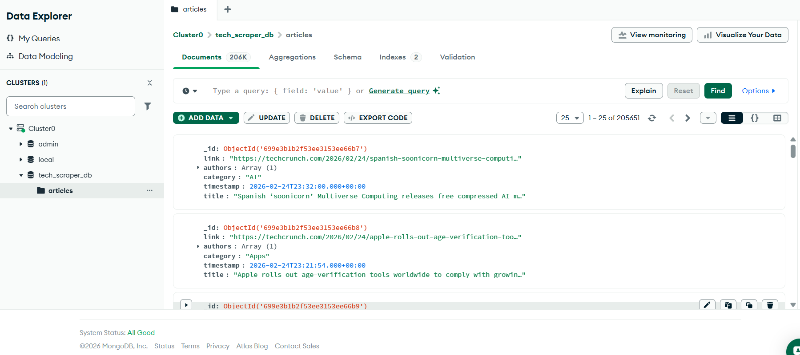
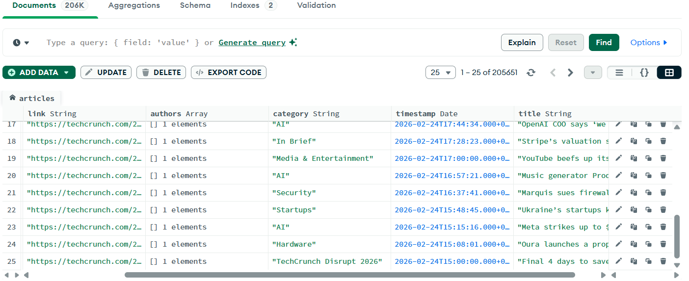
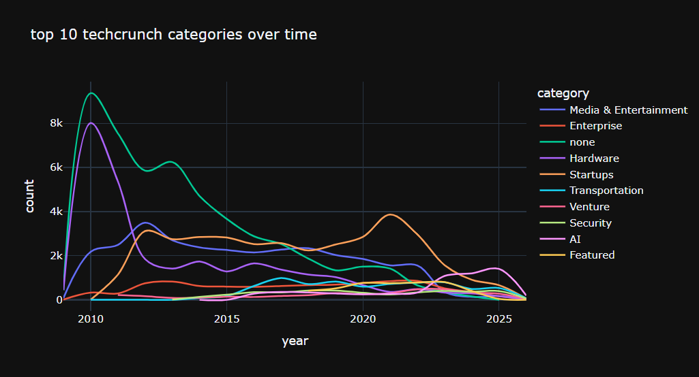
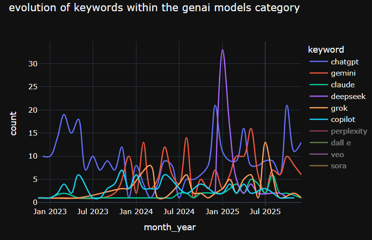
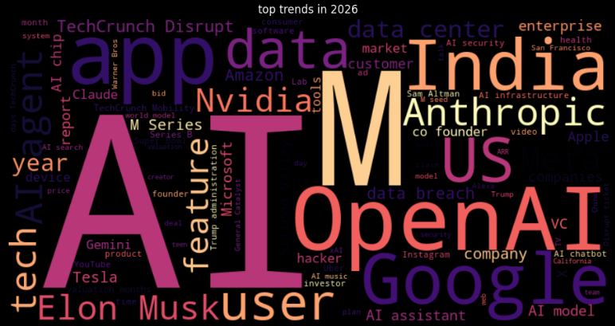

# TechScraper
A modular web scraping and data analysis tool designed to extract technical data and visualize it using Jupyter Notebooks and MongoDB.

* With this project we scrape the [TechCrunch](https://techcrunch.com/latest/) website to get articles and their basic data. The articles are listed chronologically from the newest to the oldest.
* The code has been optimized to be able to scrape as much  and as fast as possible while remaining safe enough to not be flaged by the source website's firewall and also giving options to scrape in batches.
* A GitHub Action workflow has been created to scrape the 5 latest pages of the website everyday to keep track of new articles.

## Choose Your Option

### Option A: Quick View (only observing)
If you don't want to run any code, you can see the results of the project here:

* **Data Storage:** Data is stored in a MongoDB Atlas cluster.

You can see here 2 different view of the data stored and get an idea of its schema and size

<table style="width: 100%;">
  <tr>
    <td align="center">
      
    </td>
    <td align="center">
      
    </td>
  </tr>
</table>

* **Analysis:** Insights and graphs generated in the Jupyter Notebook.

<table style="width: 100%;">
  <tr>
    <td align="center">
      
      <br><b>Comparing articles' main categories popularity</b>
    </td>
    <td align="center">
      
      <br><b>Comparing articles count for GenAI models</b>
    </td>
  </tr>
</table>

<table style="width: 100%;">
  <tr>
    <td align="center">
      
      <br><b>WordCloud for 2010</b>
    </td>
    <td align="center">
      
      <br><b>WordCloud for 2026</b>
    </td>
  </tr>
</table>

> Context, details and observations are in the notebook.

---

### Option B: Run it locally

#### 1. Prerequisites
* [Install Docker](https://docs.docker.com/get-docker/)
* [Get a MongoDB account](https://account.mongodb.com/account/register) if you want to do the scraping yourself. You can then use your own `MONGO_URI`. Or ask me for the **Read-Only** temporary access key if you want to use the notebook but don't want to deal with MongoDB

#### 2. Configuration
* Create a `.env` file in the root directory and add your connection string. it should have the following format:
```env
MONGO_URI=mongodb+srv://<username>:<password>@cluster.mongodb.net/techscraper
```
Text after the `@` may differ so no alarm if it isn't the exact same

#### 3. Execution
* Run only the scraper (lightweight):
```bash
docker-compose up scraper
```
* To run the scraper with specific parameters:
```bash
# P = number of pages to scrape, S = starting page
docker-compose run scraper --page P --start S
```
* To run the full environment (scraper + analysis notebook):
```bash
docker-compose up full
```
* Then access the Jupyter Notebook. Lokk in your terminal for a url looking like this: `http://[ip]:8888/tree?token=[token]` with `[ip]` and `[token]` being unique to you. Then open `analysis.ipynb`.

#### 4. Cleanup
When you're done don't forget to stop the containers:
* If you want to stop everything and remove the containers to save RAM/Disk space, run:
```bash
docker-compose down
```
